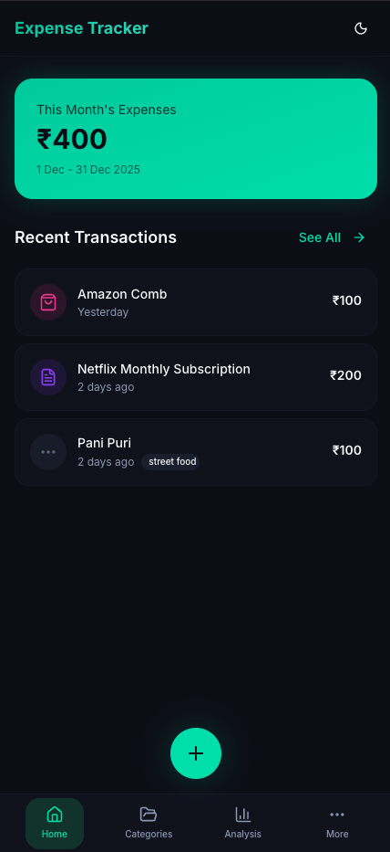
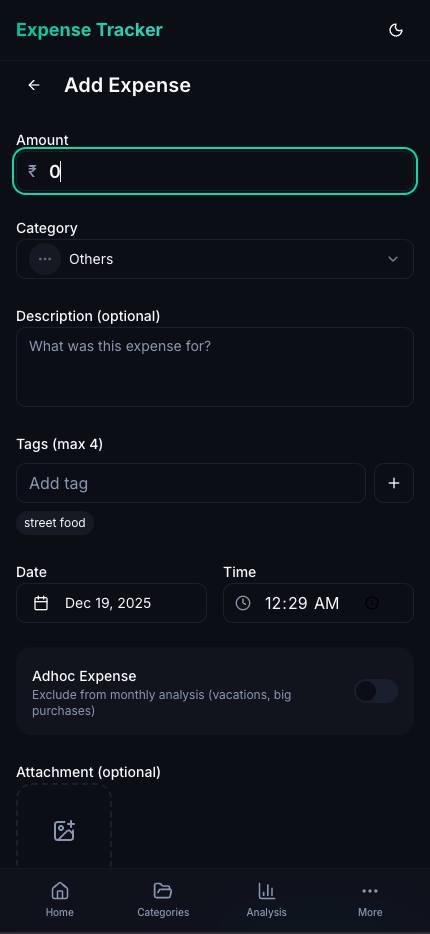
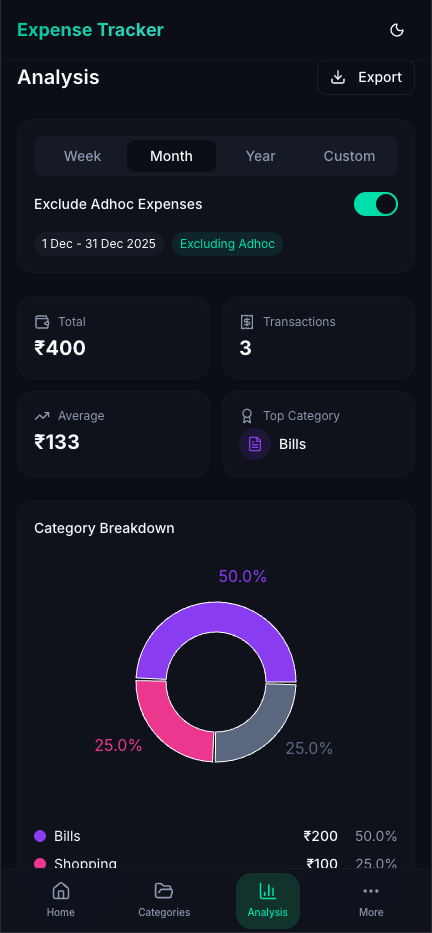

# 🚀 Expense Tracker PWA

[](LICENSE)
[](https://vitejs.dev/)
[](https://react.dev/)
[](https://dexie.org/)
[](https://tailwindcss.com/)
[](https://web.dev/progressive-web-apps/)

---

## 🎉 Welcome!

**Expense Tracker** is a privacy-first, offline-friendly, installable PWA for tracking and analyzing your personal expenses. No accounts, no backend, just pure fun and financial freedom! 🌈💸

---

## 📦 Features

- **Offline-first**: All data stored locally in your browser (IndexedDB via Dexie.js)
- **Mobile & Desktop**: Responsive, touch-friendly UI
- **PWA**: Installable on any device, works offline
- **Dark Mode**: Default, with light/system toggle
- **Expense CRUD**: Add, edit, delete, duplicate expenses
- **Categories**: Customizable, color-coded, with icons
- **Tags**: Smart suggestions, usage stats, rename/delete
- **Charts & Analysis**: Pie/bar charts, monthly summaries
- **Export/Import**: CSV/JSON export, easy restore
- **Factory Reset**: Nuke all data (if you dare!)
- **Fun UI**: Modern, animated, accessible, and energetic

📖 **[View Complete Feature Documentation](docs/features/featureset.md)**

---

## 🖼️ Screenshots

<!-- Add screenshots/gifs here! -->
<p align="center">
  
  
  
</p>

---

## 🚀 Quick Start

```bash
# 1. Clone the repo
$ git clone https://github.com/gammaSpeck/expense-tracker.git
$ cd expense-tracker

# 2. Install dependencies
$ bun install # or npm install / pnpm install

# 3. Start the dev server
$ bun run dev # or npm run dev / pnpm dev

# 4. Open http://localhost:5173 in your browser
```

---

## 🛠️ Tech Stack

- **Vite** (blazing fast dev/build)
- **React** (TypeScript)
- **shadcn/ui** (Radix UI primitives)
- **Tailwind CSS v4** (CSS-first config)
- **Dexie.js** (IndexedDB wrapper)
- **Lucide React** (icons)
- **Recharts** (charts)
- **date-fns** (date utils)
- **browser-image-compression** (attachments)
- **React Hook Form + Zod** (forms/validation)

---

## ✨ Roadmap

- [x] Expense CRUD
- [x] Category CRUD
- [x] Tag management
- [x] Charts & analysis
- [x] Export/import
- [ ] PWA support
- [ ] Multi-language support
- [ ] More themes
- [ ] Community features

---

## 🧑‍💻 Credits

- [Dexie.js](https://dexie.org/)
- [shadcn/ui](https://ui.shadcn.com/)
- [Lucide Icons](https://lucide.dev/)
- [Tailwind CSS](https://tailwindcss.com/)
- [Vite](https://vitejs.dev/)
- [Recharts](https://recharts.org/)
- [date-fns](https://date-fns.org/)

---

## 📄 License

MIT © [gammaSpeck](https://github.com/gammaSpeck)

---

## 🌟 Show Your Support

If you love this project, give it a ⭐️! Share your feedback, ideas, and screenshots!

---

## 🗺️ Community & Links

- [Changelog](CHANGELOG.md)
- [Issues](https://github.com/gammaSpeck/expense-tracker/issues)
- [Discussions](https://github.com/gammaSpeck/expense-tracker/discussions)
- [Releases](https://github.com/gammaSpeck/expense-tracker/releases)

---

> Built with 💚 for privacy, fun, and financial clarity!
